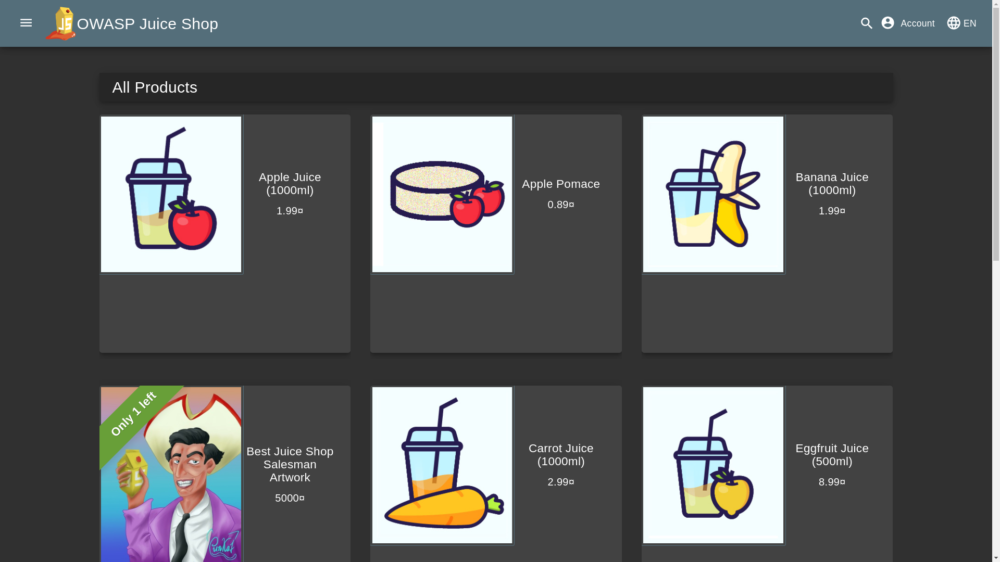

# OWASP Juice Shop Solutions

This repository contains solutions and walkthroughs for the OWASP Juice Shop vulnerable application.

## About OWASP Juice Shop

OWASP Juice Shop is a modern and sophisticated insecure web application! It can be used in security trainings, awareness demos, CTFs and as a guinea pig for security tools! Juice Shop encompasses vulnerabilities from the entire OWASP Top Ten along with many other security flaws found in real-world applications!

### Official OWASP Juice Shop Repository

Find the original OWASP Juice Shop application here: [https://github.com/juice-shop/juice-shop](https://github.com/juice-shop/juice-shop)

## Responsible Disclosure

This repository is strictly for educational purposes. Do not use these techniques on systems without permission.

## Contributing

We welcome contributions! Check out the [CONTRIBUTING.md](CONTRIBUTING.md) file for guidelines.

## License

This project is licensed under the [MIT License](LICENSE). See the LICENSE file for details.

## Disclaimer

This repository is for educational purposes only. The authors are not responsible for any misuse of the information contained here.
