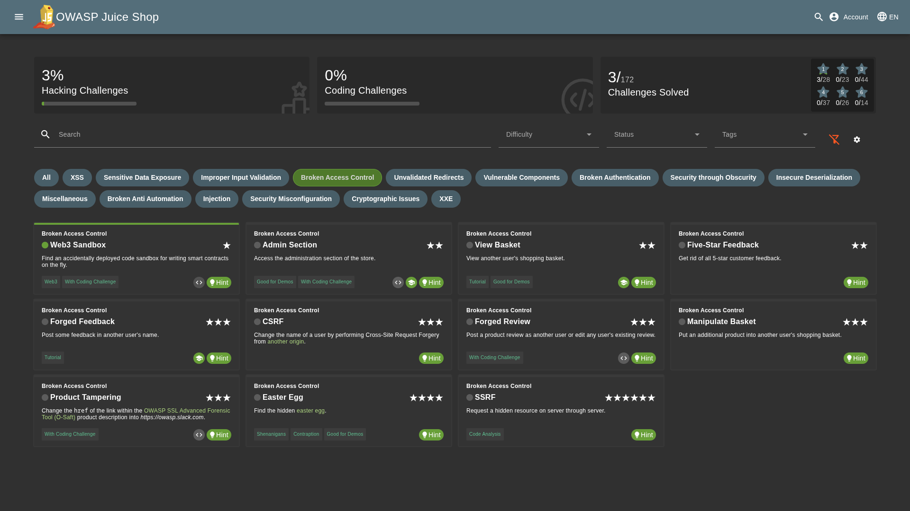

# Broken Access Control

Access control, sometimes called authorization, is how a web application grants access to content and functions to some users and not others. These checks are performed after authentication, and govern what ‘authorized’ users are allowed to do. Access control sounds like a simple problem but is insidiously difficult to implement correctly. A web application’s access control model is closely tied to the content and functions that the site provides. In addition, the users may fall into a number of groups or roles with different abilities or privileges. [[Source]](https://owasp.org/www-community/Broken_Access_Control)

