# SOLUTIONS

## 1.Web3 Sandbox

### 1.1.Objective

Find an accidentally deployed code sandbox for writing smart contracts on the fly.

### 1.2.Solution

A Web3 sandbox is a testing environment designed for experimenting with Web3 technologies, such as blockchain, NFTs, and decentralized applications (dApps), in a controlled setting.

If you search for `web3-sandbox` in the `main.js` file, you can find that the application has a path for the sandbox environment.

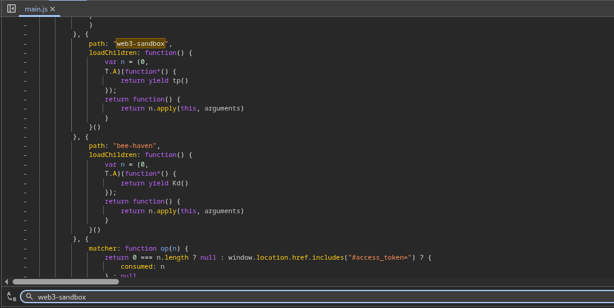

Now visit `/#/web3-sandbox` to access the sandbox environment and solve the lab.

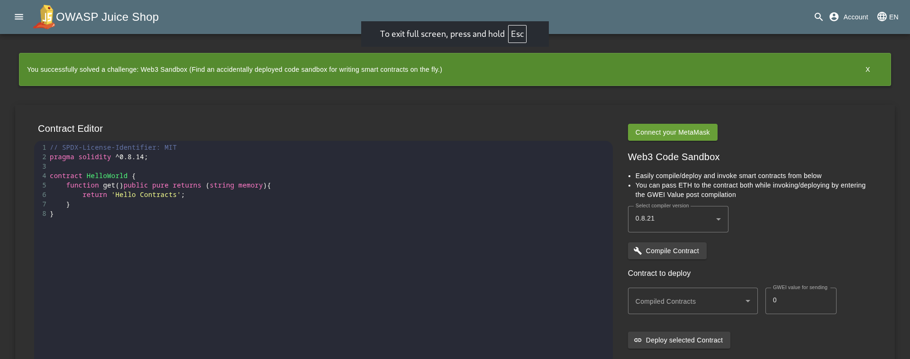

## 2.Admin Section

### 2.1.Objective

Access the administration section of the store.

### 2.2.Solution

To access the **administration** section of the OWASP Juice Shop, you first need to log in as `administrator`. Then search for keywords like `admin` or `administration`. After you find the object for the routing path, visit the URL (`/#/administration`).

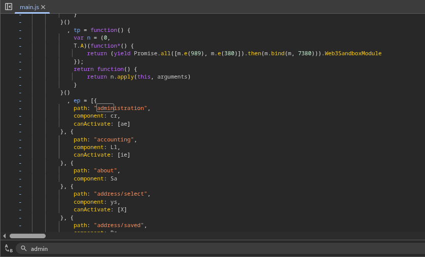

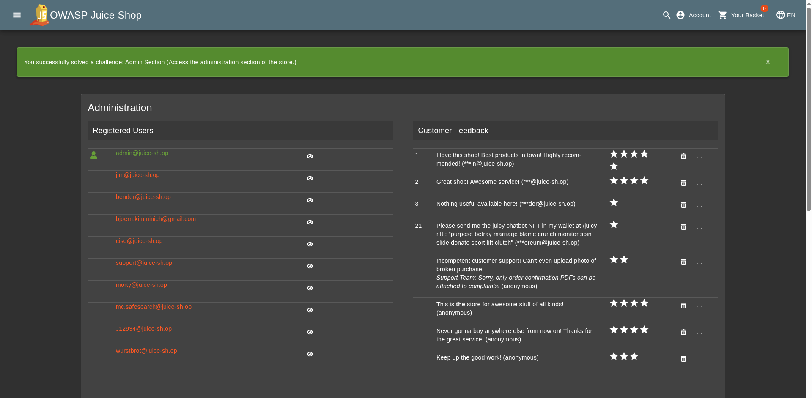

## 3.View Basket

### 3.1.Objective

View another user's shopping basket.

### 3.2.Solution

Investigate what information is being sent to the server when the `“View Basket”` link is clicked. The URL `/rest/basket/1` seems to be fetching the basket information in JSON format. Hmm, maybe the number `1` is associated with `user ID` or something. Change the value of `1` to any other number to check if we can fetch other users' basket data.

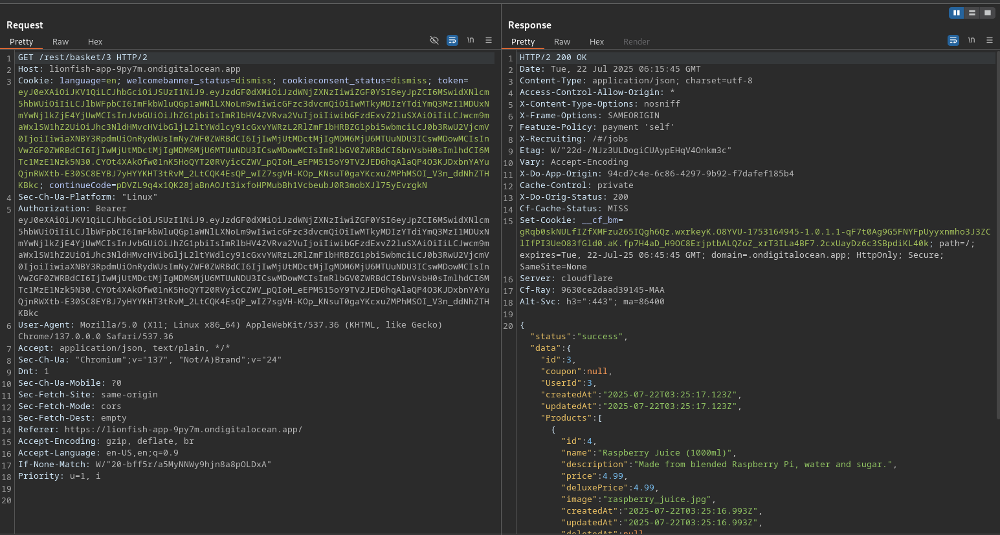

We are successfully able to fetch other users' basket data.

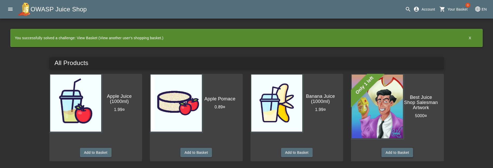

## 4.Five-Star Feedback

### 4.1.Objective

Get rid of all 5-star customer feedback.

### 4.2.Solution

After successfully solving the [admin section challenge](#2admin-section), visit the **Administration** page (`/#/administration`) and delete all Five-Star Feedback.

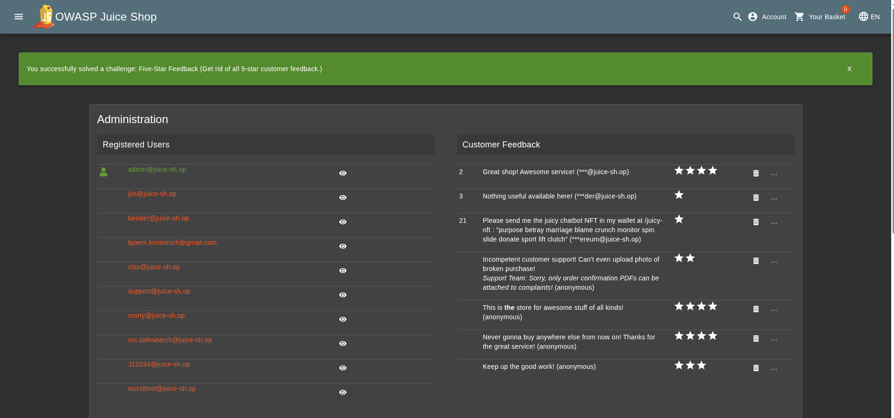

## 5.Forged Feedback

### 5.1.Objective

Post some feedback in another user's name.

### 5.2.Solution

Post feedback and investigate what information is being sent to the server.

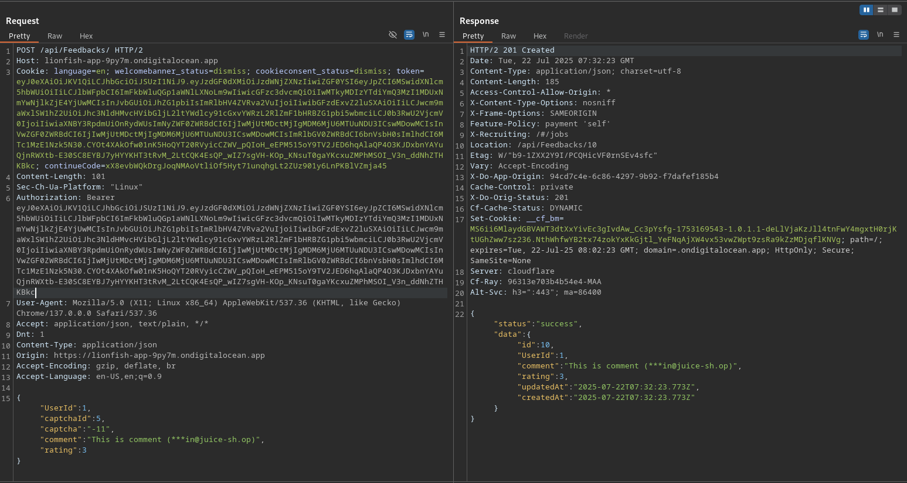

The feedback is being posted on the URL `/api/Feedbacks` with payloads like `userId`. Change the `userId` to forge the feedback.

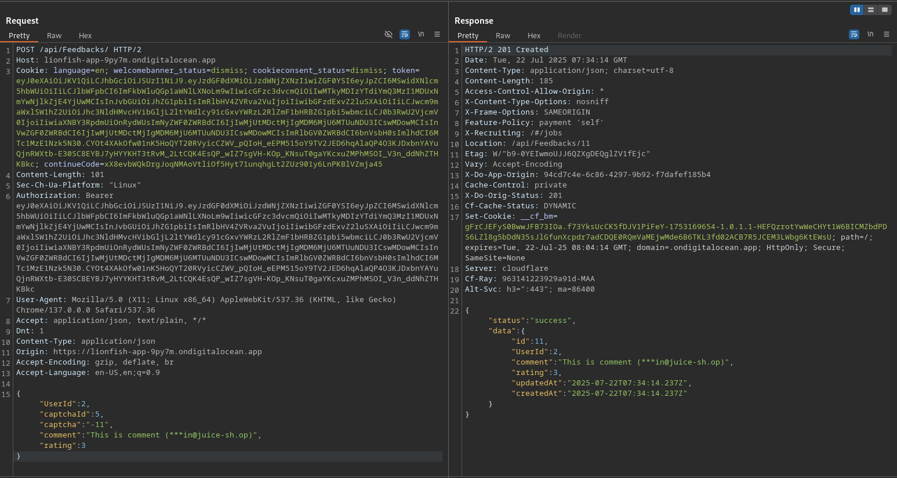

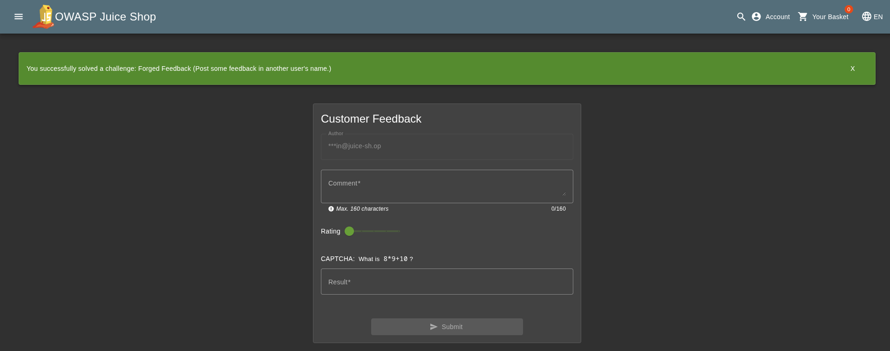

## 6.CSRF

### 6.1.Objective

Change the name of a user by performing Cross-Site Request Forgery from [another origin (http://htmledit.squarefree.com/)](http://htmledit.squarefree.com/). **Make sure it supports HTTP (no TLS) to avoid any conflicts with the *mixed-content policy* in the browser**

### 6.2.Solution

To perform CSRF attacks and change the name of the user on the `/profile` page, craft a HTML page that issues a `POST` request automatically using JavaScript or `<form>` + `autosubmit`.

```html
<form action="http://[JUICE-SHOP-DOMAIN]/profile" method="POST">
  <input type="text" name="username" id="username" value="newuser"/>
  <input type="submit"/>
</form>
<script>document.forms[0].submit();</script>
```

## 7.Forged Review

### 7.1.Objective

Post a product review as another user or edit any user's existing review.

### 7.2.Solution

Post a review and investigate what information is being sent to the server.

The server fetches the review of a product from **URL** `/rest/product/2/reviews` where `2` is probably product ID.

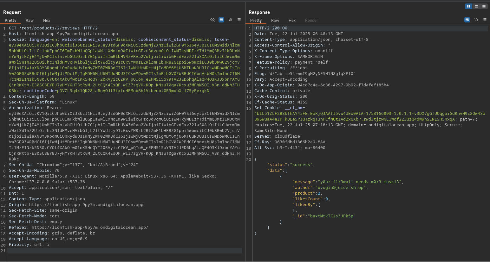

When you post your review to that product, the application issues a **PUT** request with payload `message` and `author`.

```json
{"message":"This is a review","author":"admin@juice-sh.op"}
```

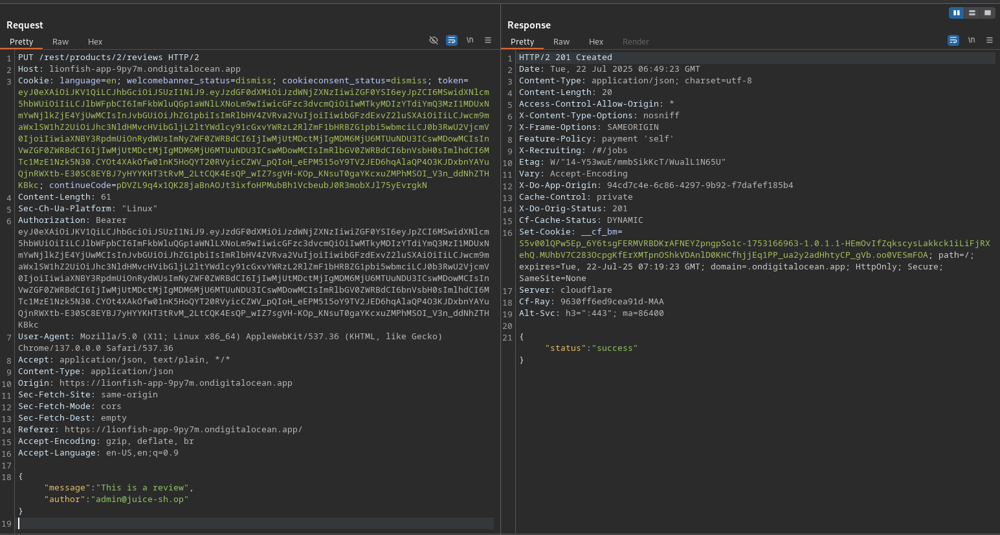

Let's change the author email to check if we can forge review. You can find emails of other registered users in the [admin section](#2admin-section).

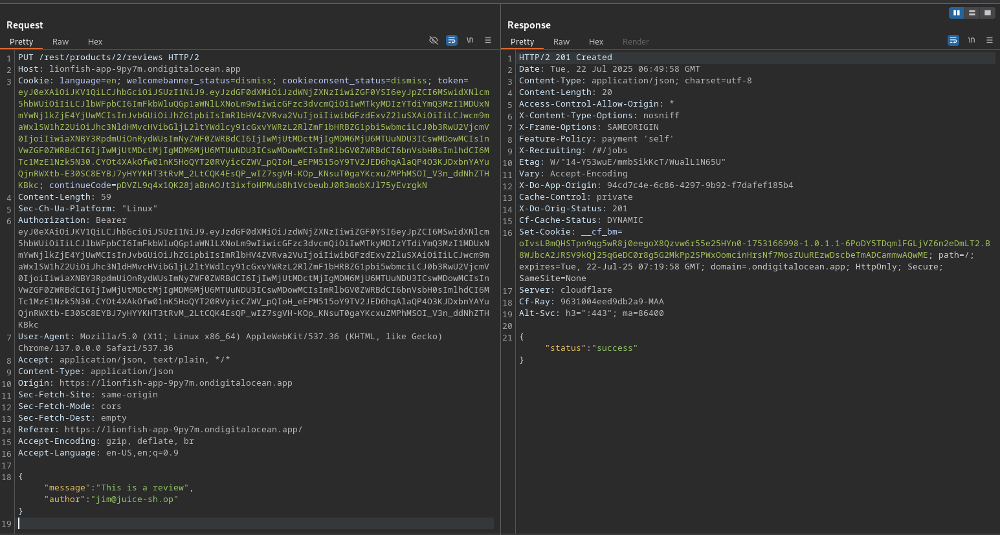

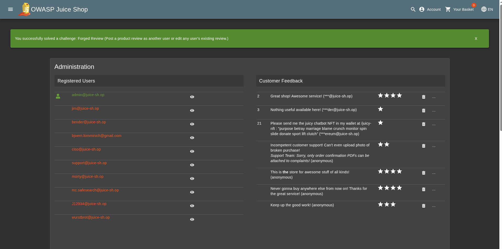
