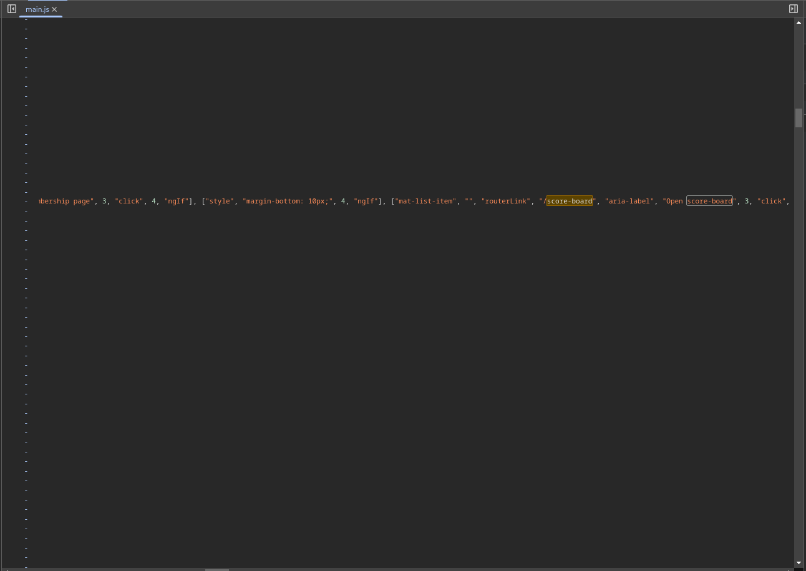
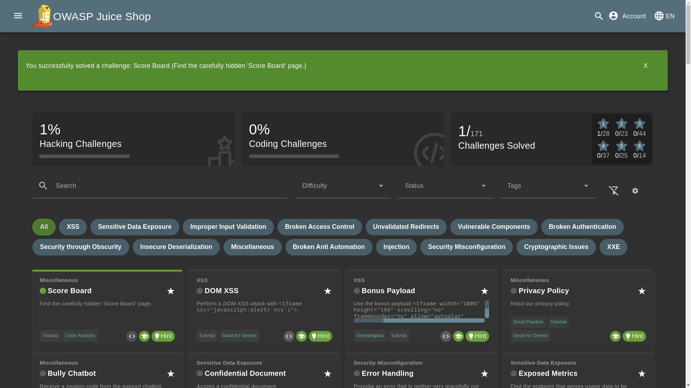

# About OWASP Juice Shop

OWASP Juice Shop is a modern and sophisticated insecure web application! It can be used in security training, awareness demos, CTFs, and as a guinea pig for security tools! Juice Shop encompasses vulnerabilities from the entire [OWASP Top Ten](https://owasp.org/www-project-top-ten/) along with many other security flaws found in real-world applications!

The application contains a vast number of hacking challenges of varying difficulty. The user is supposed to exploit the underlying vulnerabilities. The hacking progress is tracked on a scoreboard mentioned [here](https://owasp.org/www-project-juice-shop/).

## Finding Score Board

The first step is to look at the application source code. The application seems to be a single-page application it has an app-root tag. The page loads three javascript files `runtime.js`, `polyfill.js`, `vendor.js`, and `main.js`.

**Let's examine each one of them:**

If you take a good look at the main.js file you can find that it contains many routes like `/login`, `/accounting`, `/contact`, etc. Along with the location of the **scoreboard**.

From the above image, you can see that the URL/location of the scoreboard is `/score-board`.

