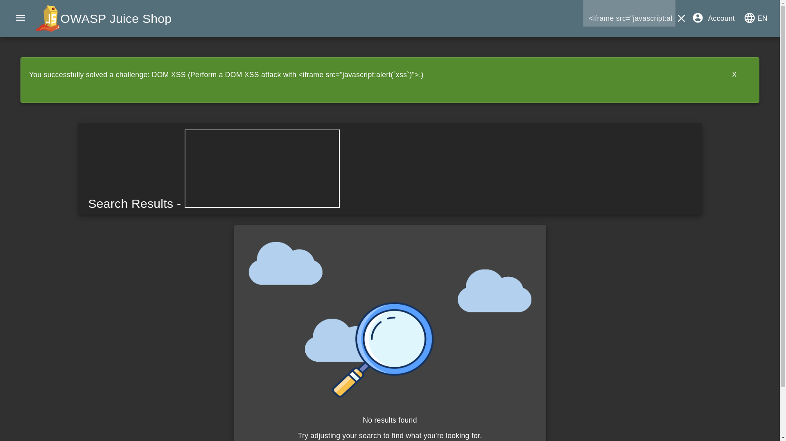

# Dom Xss

## Lab Description

To Perform a DOM XSS attack with `<iframe src="javascript:alert(`xss`)">`

## About

DOM Based XSS is an XSS attack wherein the attack payload is executed as a result of modifying the DOM “environment” in the victim’s browser used by the original client side script, so that the client side code runs in an “unexpected” manner. [source](https://owasp.org/www-community/attacks/DOM_Based_XSS)

## Solution

Enter `<iframe src="javascript:alert(`xss`)">` at search box to solve the challenge.

